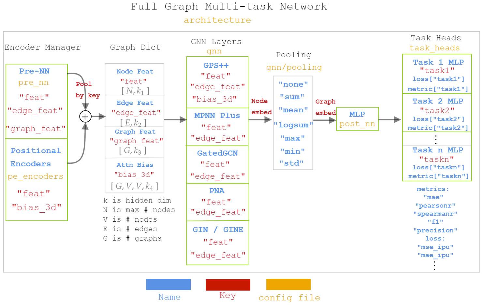

<div align="center">
    
    <h3>Scaling molecular GNNs to infinity</h3>
</div>

---

[](https://ipu.dev/sdGggS)
[](https://pypi.org/project/graphium/)
[](https://anaconda.org/conda-forge/graphium)
[](https://pypi.org/project/graphium/)
[](https://anaconda.org/conda-forge/graphium)
[](https://github.com/datamol-io/graphium/blob/main/LICENSE)
[](https://github.com/datamol-io/graphium/stargazers)
[](https://github.com/datamol-io/graphium/network/members)
[](https://github.com/datamol-io/graphium/actions/workflows/test.yml)
[](https://github.com/datamol-io/graphium/actions/workflows/test_ipu.yml)
[](https://github.com/datamol-io/graphium/actions/workflows/release.yml)
[](https://github.com/datamol-io/graphium/actions/workflows/code-check.yml)
[](https://github.com/datamol-io/graphium/actions/workflows/doc.yml)
[](https://codecov.io/gh/datamol-io/graphium)
[](https://hydra.cc/)

A deep learning library focused on graph representation learning for real-world chemical tasks.

- ✅ State-of-the-art GNN architectures.
- 🐍 Extensible API: build your own GNN model and train it with ease.
- ⚗️ Rich featurization: powerful and flexible built-in molecular featurization.
- 🧠 Pretrained models: for fast and easy inference or transfer learning.
- ⮔ Read-to-use training loop based on [Pytorch Lightning](https://www.pytorchlightning.ai/).
- 🔌 Have a new dataset? Graphium provides a simple plug-and-play interface. Change the path, the name of the columns to predict, the atomic featurization, and you’re ready to play!

## Documentation

Visit https://graphium-docs.datamol.io/.

[](https://ipu.dev/sdGggS)

You can try running Graphium on Graphcore IPUs for free on Gradient by clicking on the button above.

## Installation for developers

### For CPU and GPU developers

Use [`mamba`](https://github.com/mamba-org/mamba):

```bash
# Install Graphium's dependencies in a new environment named `graphium`
mamba env create -f env.yml -n graphium

# Install Graphium in dev mode
mamba activate graphium
pip install --no-deps -e .
```

### For IPU developers
```bash
# Install Graphcore's SDK and Graphium dependencies in a new environment called `.graphium_ipu`
./install_ipu.sh .graphium_ipu
```

The above step needs to be done once. After that, enable the SDK and the environment as follows:

```bash
source enable_ipu.sh .graphium_ipu
```

## Training a model

To learn how to train a model, we invite you to look at the documentation, or the jupyter notebooks available [here](https://github.com/datamol-io/graphium/tree/master/docs/tutorials/model_training).

If you are not familiar with [PyTorch](https://pytorch.org/docs) or [PyTorch-Lightning](https://pytorch-lightning.readthedocs.io/en/latest/), we highly recommend going through their tutorial first.

## Running an experiment
We have setup Graphium with `hydra` for managing config files. To run an experiment go to the `expts/` folder. For example, to benchmark a GCN on the ToyMix dataset run
```bash
graphium-train dataset=toymix model=gcn
```
To change parameters specific to this experiment like switching from `fp16` to `fp32` precision, you can either override them directly in the CLI via
```bash
graphium-train dataset=toymix model=gcn trainer.trainer.precision=32
```
or change them permamently in the dedicated experiment config under `expts/hydra-configs/toymix_gcn.yaml`.
Integrating `hydra` also allows you to quickly switch between accelerators. E.g., running
```bash
graphium-train dataset=toymix model=gcn accelerator=gpu
```
automatically selects the correct configs to run the experiment on GPU.
Finally, you can also run a fine-tuning loop: 
```bash
graphium-train +finetuning=admet
```

To use a config file you built from scratch you can run
```bash
graphium-train --config-path [PATH] --config-name [CONFIG]
```
Thanks to the modular nature of `hydra` you can reuse many of our config settings for your own experiments with Graphium.

## Preparing the data in advance
The data preparation including the featurization (e.g., of molecules from smiles to pyg-compatible format) is embedded in the pipeline and will be performed when executing `graphium-train [...]`.

However, when working with larger datasets, it is recommended to perform data preparation in advance using a machine with sufficient allocated memory (e.g., ~400GB in the case of `LargeMix`). Preparing data in advance is also beneficial when running lots of concurrent jobs with identical molecular featurization, so that resources aren't wasted and processes don't conflict reading/writing in the same directory.

The following command-line will prepare the data and cache it, then use it to train a model.
```bash
# First prepare the data and cache it in `path_to_cached_data`
graphium data prepare ++datamodule.args.processed_graph_data_path=[path_to_cached_data]

# Then train the model on the prepared data
graphium-train [...] datamodule.args.processed_graph_data_path=[path_to_cached_data]
```

**Note** that `datamodule.args.processed_graph_data_path` can also be specified at `expts/hydra_configs/`.

**Note** that, every time the configs of `datamodule.args.featurization` changes, you will need to run a new data preparation, which will automatically be saved in a separate directory that uses a hash unique to the configs.

## License

Under the Apache-2.0 license. See [LICENSE](LICENSE).

## Documentation

- Diagram for data processing in Graphium.


- Diagram for Muti-task network in Graphium


